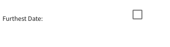
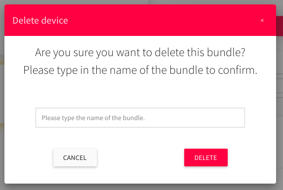
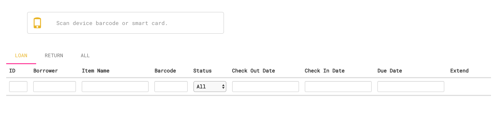
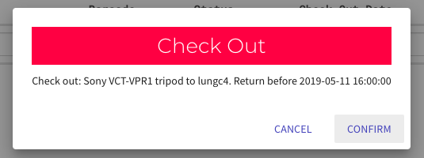

# Facilitiy Booking System

_Comming Soon_ 

# Equipment Booking System

# Users' Instructions

# Admins' Instructions

## Main Page

    (1) : Side menu
    (2) : Selected tab
    (3) : Main screen

## Devices - Adding a new device

1. Press the add button

2. Input all information inside the dialog

__Quantity__ : Number of devices

__Available Quantity__ : Number of devices that are opened for booking.

**You cannot change the name of the device once you have clicked the _NEXT_ button.**

3. Upload images for the device.

You must upload a cover image for the new device by clicking on the oarange box.

4. Choose a _Furthest Date_

Furthest Date is the maximum date that the device can be booked.

You can uncheck the box if you don't need this setting.

5. More settings.

__Publish__ : Is the device opened to public or admins only?

__Permission__ : Is the device opened to all users or staff only?

__Resources Admin__ : Who can modify the device? Enter a valid weblogin ID. Use _comma_, _space_, _semicolon_ or _enter_ to separate IDs.

__Google Calendar__ : The calendar ID of google calendar.

6. Final checking

## Device - Updating a device

1. General Information

Click on the device that you want to modify

Selected device's shadow is in orange colour.

2. Photo

When you click on one of these boxes, a small window pop up.

_Upload_ : Upload new image.

_Browse Uploaded_ : Select image from all uploaded images.

It shows all uploaded images.

Cover image can't be empty, which means you can't save it when you have selected the empty box.

You can only delete a image when it is not displaying.

3. Unit

Manage units of the device here.

4. Admin Setting

The only difference between this and the one in adding dialog is that you can only separate admin weblogin ID with _comma_ here.

5. Loan History

You cannot change anything here. But you can check the record here.

6. Delete Device

Think carefully before you delete a device. All related request will be deleted as well.

## Bundles - Adding a new bundle

1. Press the add button

2. Input the name of the new bundle

3. Select devices that will be included in this bundle

4. Submit

## Bundles - Editing a bundle

Click on the bundle that you want to modify

Selected bundle's shadow is in orange colour.

1. General information

2. Items

Able to manage items inside this bundle.

3. Delete bundle

Think carefully before you delete a bundle.

## Time setting

You can mangage the pickup and return time here.

## Check in & out

You can either input __Device Barcode__ or __Weblogin ID__

__Device Barcode__ : If you input device barcode first, you can :

1. Check in the device (if the device has been checked out)

2. Get the status of the device (if the device is still available)

__Weblogin ID__ : If you input Weblogin ID first, you can :

1. Get user's information

__Loan History__ : The checkout and checkin list of that user

__Reservation__ : All information of requests made by that user 

The status is in green colour if user return the device in time; while it is in red colour if user return the device after the due date.

__Clear__ : Use this when you want to deal with another user

__Weblogin ID -> Barcode__ : Checkout an item

__Weblogin ID -> Weblogin ID__ : Nothing Happen

__Record Table__

Able to check all records here

__Loan__ : All check out records

Click on the hourglass icon to extend user's request.

Input new return due date and time inside the dialog.

_Note that it only extend one item but not the whole request._

__Return__ : All check in records

__All__ : Both records

## Pending List

### Pending List

Manage pending request here.

You can either approve here or through [email](#email).

### In Progress

Showing all approved requests

You can cancel an approved request but you cannout cancel it once the device is checked out.

^ _Approved_

^ _Checked out_ / _Extended_

### Completed

There is a dropdown list below the table. Use this to filter records according to the pickup date.

## Admin Reserve

If you are the admin of a device, you can reserve that device without approving. It will automatically add an event to your google calendar as well.

^ Not admin

^ Shows device only if you are admin of it

This reserve function is designed for ad hoc checkout so you won't have to input pick up date and time.

## Email

### User Receipt

When user request some devices, they will receive a receipt.

### Admin Pending

When user request a device, admin of that device will receive an email.

Admin can approve / decline the request through the email.

Nothing happens if you have already approved the request but click on the _Approve_ button again.

### User Approved / Declined

User will receive an email if admin approve / decline their request.

### User Cancel Approved

Admin will receive an email if user cancel an approved request.

### User Cancel Pending

User will receive an email if he/she cancel a pending request.

### User Admin Cancel

User will receive an email if admin cancel his/her request

### User Late

User will receive an email every 9 am in the morning if he/she hasn't return the device after due date.

### User didn't Pick up all items

User will receive an email every 7 am if he/she hasn't pick up all requested items.
